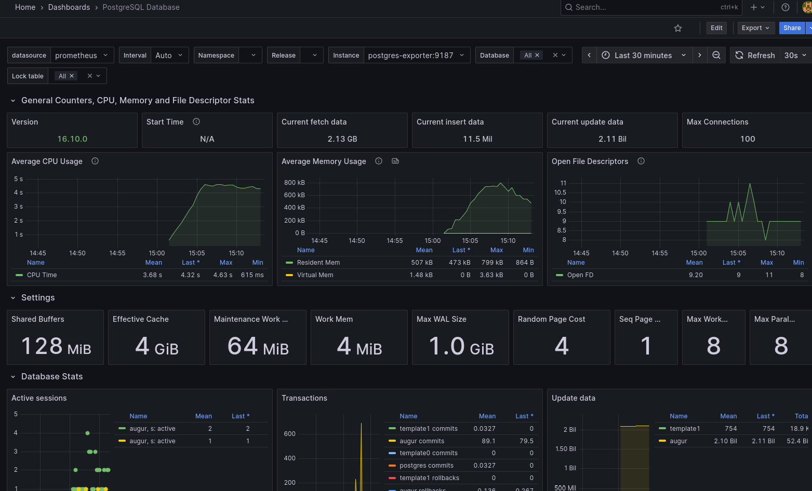

# Augur Monitoring Grafana Stack
This repo contains a container stack (works with docker/podman compose) which sets up grafana and prometheus to monitor an Augur instance. This helps provide a more time-series look at various augur parameters and statistics for long-term health monitoring by the system admin.

This includes:
- monitoring the augur postgres database (requires a user with access)
- monitoring celery tasks through flower (requires the flower interface to be up)

## Setup:
1. clone the repo
2. create a .env file containing your Augur DB credentials and preferred grafana login. A template is available in `.env.sample`
3.  (optional) for host metrics on debian systems, install the package `prometheus-node-exporter`
4. do `podman compose up -d` or `docker compose up -d` from the root of the repo to start the monitoring stack
   - if you have a .env file with a different name than `.env`, you'll probably want to include `--env-file=<your env file>` in the command.

## Viewing the Dashboards:

1. start up the augur stack
2. navigate to http://localhost:3000 in your browser
3. login with the credentials admin/password
4. navigate to Dashboards in the Web UI and select a dashboard

## Worth Noting

Grafana in particular takes a hot sec to start up (probably about a minute) before its accessible via the web interface (it has db migrations to do apparrently - the logs for this should be hidden by the instruction to only show error logs)

Data is not currently preserved between restarts of the monitoring stack.

This is intended and designed to run independently of augur (by relying on the ports that the augur docker stack exposes). This makes it possible to take augur down and back up without affecting the monitoring stack other than creating a gap in the graphs where no data could be collected.

## Dashboards

In addition to some useful off the shelf dashboards for monitoring things like Celery, Postgres, and the system host, there are also some custom dashboards for monitoring Augur itself using custom queries designed to actually look at the Augur database.

This uses https://github.com/albertodonato/query-exporter to make the results of postgres queries available to prometheus, which checks them periodically and stores the data for grafana to visualize.

Grafana also has a built-in postgres module for making queries that do not need time-series data to be stored by Prometheus. This is useful for one-off things that can just be regularly updated, such as a list of repos currently being processed (coming soon).

